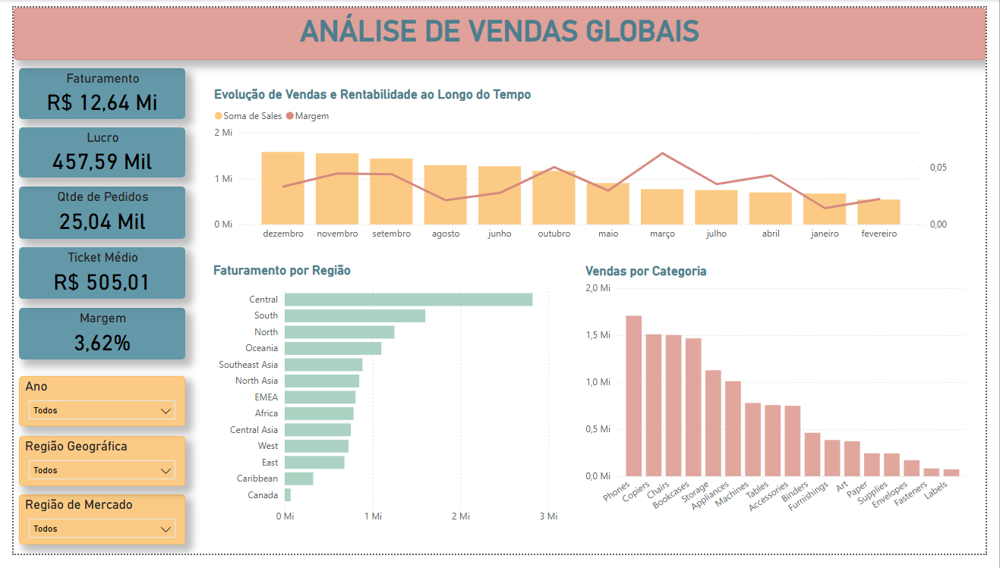
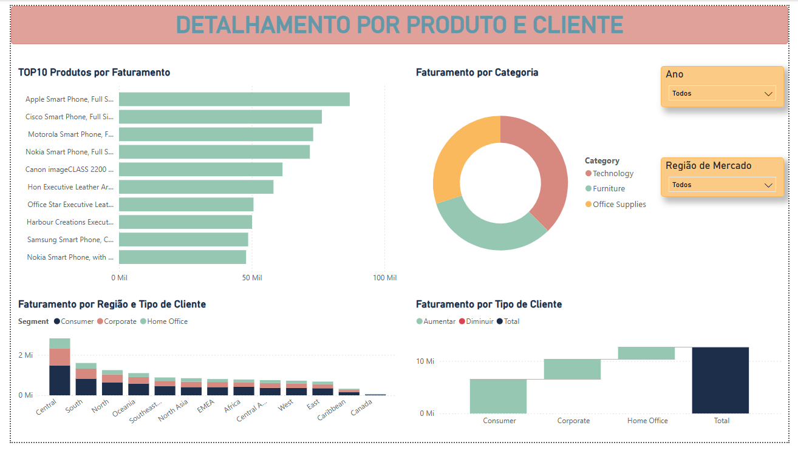

# 📊 Análise de Vendas Globais com Power BI

## 🎯 Objetivo
Este projeto tem como objetivo analisar dados de vendas globais para identificar padrões, oportunidades e insights estratégicos que apoiem a tomada de decisão.

## 📌 Visão Geral do Dashboard
O dashboard foi estruturado em duas páginas principais:

### 1. Análise Geral
- Indicadores-chave (KPIs):
  - Faturamento total: R$ 12,64 Mi
  - Lucro: R$ 457,59 mil
  - Ticket médio: R$ 505,01
  - Margem: 3,62%
  - Volume de pedidos: 25 mil

- Análises realizadas:
  - Evolução de vendas e margem ao longo do tempo
  - Comparação de faturamento por região
  - Desempenho por categoria de produtos

### 2. Detalhamento por Produto e Cliente
- Top 10 produtos por faturamento
- Distribuição de faturamento por categoria
- Análise por tipo de cliente (Consumer, Corporate, Home Office)
- Comparação regional por segmento de cliente

## 🔍 Principais Insights
- A região Central apresenta o maior volume de faturamento, indicando forte concentração de vendas
- A categoria Technology lidera em receita, sendo um dos principais motores do negócio
- A margem de lucro relativamente baixa (~3,6%) pode indicar custos elevados ou necessidade de otimização
- O segmento Consumer representa a maior parcela do faturamento total

## 🛠 Tecnologias Utilizadas
- Power BI
- Excel (tratamento e preparação de dados)

## ⚙️ Etapas do Projeto
1. Coleta e entendimento dos dados
2. Tratamento e limpeza
3. Modelagem dos dados
4. Criação de medidas (DAX)
5. Construção do dashboard
6. Análise e geração de insights

## 📷 Visual do Dashboard
# 📷 Dashboard - Visão Geral

# 📷 Dashboard - Detalhamento

## 📁 Dataset
Superstore Global Dataset (dados fictícios amplamente utilizados para estudos de análise de dados)

## 🚀 Sobre o Projeto
Este projeto foi desenvolvido com foco em análise exploratória e construção de dashboards interativos, simulando um cenário real de negócios.

---